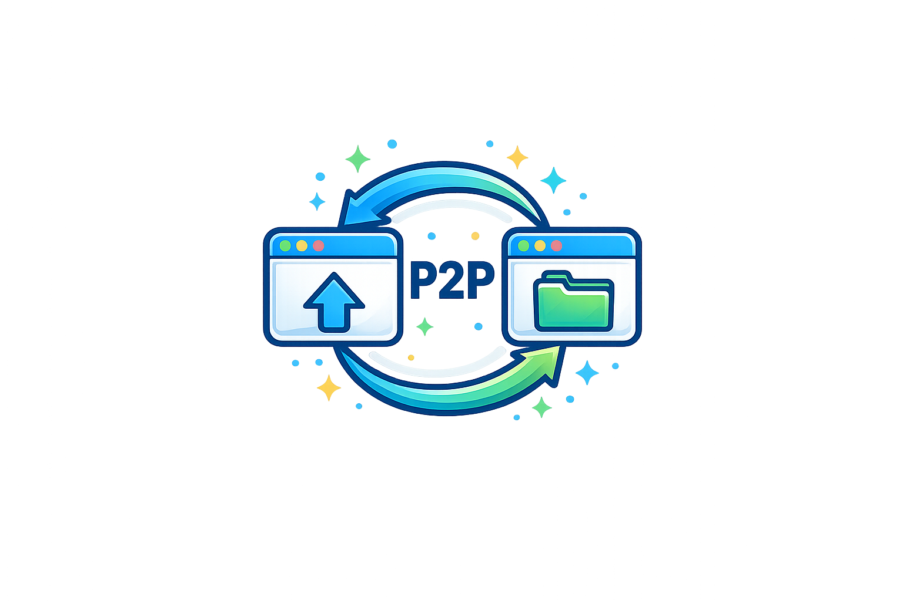

<a id="readme-top"></a>

[![Contributors][contributors-shield]][contributors-url]
[![Forks][forks-shield]][forks-url]
[![Stargazers][stars-shield]][stars-url]
[![Issues][issues-shield]][issues-url]
[![project_license][license-shield]][license-url]
[![LinkedIn][linkedin-shield]][linkedin-url]

<br />
<div align="center">
  <a href="https://github.com/17addisonlin/Peer-to-Peer-File-Sharing-System">
<<<<<<< HEAD
    
  </a>

  <h3 align="center">Peer-to-Peer File Sharing System</h3>

  <p align="center">
    A browser-based P2P file sharing demo using WebRTC data channels with a WebSocket signaling server and a 4-digit PIN pairing flow.
    <br />
    <a href="https://github.com/17addisonlin/Peer-to-Peer-File-Sharing-System"><strong>Explore the docs »</strong></a>
    <br />
    <br />
    <a href="https://github.com/17addisonlin/Peer-to-Peer-File-Sharing-System">View Demo</a>
    &middot;
    <a href="https://github.com/17addisonlin/Peer-to-Peer-File-Sharing-System/issues/new?labels=bug&template=bug-report---.md">Report Bug</a>
    &middot;
    <a href="https://github.com/17addisonlin/Peer-to-Peer-File-Sharing-System/issues/new?labels=enhancement&template=feature-request---.md">Request Feature</a>
  </p>
</div>

<details>
  <summary>Table of Contents</summary>
  <ol>
    <li>
      <a href="#about-the-project">About The Project</a>
      <ul>
        <li><a href="#built-with">Built With</a></li>
        <li><a href="#features">Features</a></li>
      </ul>
    </li>
    <li>
      <a href="#getting-started">Getting Started</a>
      <ul>
        <li><a href="#prerequisites">Prerequisites</a></li>
        <li><a href="#installation">Installation</a></li>
        <li><a href="#running-locally">Running Locally</a></li>
      </ul>
    </li>
    <li><a href="#usage">Usage</a></li>
    <li><a href="#troubleshooting">Troubleshooting</a></li>
    <li><a href="#security--privacy-notes">Security & Privacy Notes</a></li>
    <li><a href="#roadmap">Roadmap</a></li>
    <li><a href="#contributing">Contributing</a></li>
    <li><a href="#license">License</a></li>
    <li><a href="#contact">Contact</a></li>
    <li><a href="#acknowledgments">Acknowledgments</a></li>
  </ol>
</details>

## About The Project

[![Product Name Screen Shot][product-screenshot]](https://example.com)

This project is a lightweight peer-to-peer file sharing web app. It uses WebRTC data channels to send files directly between browsers and a small WebSocket signaling server to exchange offers, answers, and ICE candidates. A 4-digit PIN makes pairing simple and prevents cross‑talk when multiple users are online.

<p align="right">(<a href="#readme-top">back to top</a>)</p>

### Built With

* [![Node][Node.js]][Node-url]
* [![WebRTC][WebRTC-badge]][WebRTC-url]
* [![WebSocket][WebSocket-badge]][WebSocket-url]
* [![HTML5][HTML5-badge]][HTML5-url]
* [![CSS3][CSS3-badge]][CSS3-url]
* [![JavaScript][JavaScript-badge]][JavaScript-url]

<p align="right">(<a href="#readme-top">back to top</a>)</p>

### Features

- Direct browser-to-browser file transfer via WebRTC
- 4-digit PIN pairing to connect the right devices
- Works across tabs or devices on the same network
- Simple signaling server for offers/answers/ICE candidates
- Clean, guided UI with “How to Use” steps

<p align="right">(<a href="#readme-top">back to top</a>)</p>

## Getting Started

### Prerequisites

- Node.js 18+
- npm (ships with Node.js)

### Installation

1. Clone the repo
   ```sh
   git clone https://github.com/17addisonlin/Peer-to-Peer-File-Sharing-System.git
   ```
2. Install dependencies
   ```sh
   npm install
   ```

### Running Locally

1. Start the signaling server
   ```sh
   node server.js
   ```
2. Serve the frontend in a second terminal
   ```sh
   npx serve ./public
   ```
3. Open the URL from `serve` in two tabs or devices.

<p align="right">(<a href="#readme-top">back to top</a>)</p>

## Usage

1. Open the site on two tabs or devices (same Wi‑Fi recommended).
2. On the receiving device, click **Start Receiving** to generate a 4‑digit PIN.
3. On the sending device, enter that PIN, choose a file, and click **Send File**.
4. The receiver gets a download link when the transfer completes.
5. Either side can send again without refreshing.

<p align="right">(<a href="#readme-top">back to top</a>)</p>

## Troubleshooting

- **“Upgrade Required” in the browser:** you opened the WebSocket server directly. Use the static server URL (from `npx serve ./public`).
- **No connection or file transfer:** verify both tabs show “Connected to signaling server” in the console.
- **Works on one machine but not between devices:** ensure both devices are on the same network and use the same host IP in the static server URL.
- **Room is full:** only two peers can join the same PIN at once.

<p align="right">(<a href="#readme-top">back to top</a>)</p>

## Security & Privacy Notes

- Transfers are peer-to-peer; the signaling server never sees the file contents.
- A 4‑digit PIN is meant for convenience, not strong security. For sensitive files, use a longer PIN or add authentication.
- For use across the public internet, you will likely need a TURN server.

<p align="right">(<a href="#readme-top">back to top</a>)</p>

## Roadmap

- [ ] File metadata (name, size, type) shown on receive
- [ ] Progress bar and transfer speed indicators
- [ ] Optional 6‑digit PIN / time‑limited rooms
- [ ] TURN server support for NAT traversal

See the [open issues](https://github.com/17addisonlin/Peer-to-Peer-File-Sharing-System/issues) for a full list of proposed features and known issues.

<p align="right">(<a href="#readme-top">back to top</a>)</p>

## Contributing

Contributions are welcome. If you have improvements or bug fixes, please open an issue or submit a pull request.

1. Fork the Project
2. Create your Feature Branch (`git checkout -b feature/AmazingFeature`)
3. Commit your Changes (`git commit -m 'Add some AmazingFeature'`)
4. Push to the Branch (`git push origin feature/AmazingFeature`)
5. Open a Pull Request

<p align="right">(<a href="#readme-top">back to top</a>)</p>

## License

Distributed under the MIT License. See `LICENSE` for more information.

<p align="right">(<a href="#readme-top">back to top</a>)</p>

## Contact

Addison Lin - [LinkedIn](https://www.linkedin.com/in/addison-lin-227002274/)

Project Link: [https://github.com/17addisonlin/Peer-to-Peer-File-Sharing-System](https://github.com/17addisonlin/Peer-to-Peer-File-Sharing-System)

<p align="right">(<a href="#readme-top">back to top</a>)</p>

## Acknowledgments

* [Best-README-Template](https://github.com/othneildrew/Best-README-Template)
* [WebRTC](https://webrtc.org/)
* [ws](https://github.com/websockets/ws)

<p align="right">(<a href="#readme-top">back to top</a>)</p>

<!-- MARKDOWN LINKS & IMAGES -->
[contributors-shield]: https://img.shields.io/github/contributors/17addisonlin/Peer-to-Peer-File-Sharing-System.svg?style=for-the-badge
[contributors-url]: https://github.com/17addisonlin/Peer-to-Peer-File-Sharing-System/graphs/contributors
[forks-shield]: https://img.shields.io/github/forks/17addisonlin/Peer-to-Peer-File-Sharing-System.svg?style=for-the-badge
[forks-url]: https://github.com/17addisonlin/Peer-to-Peer-File-Sharing-System/network/members
[stars-shield]: https://img.shields.io/github/stars/17addisonlin/Peer-to-Peer-File-Sharing-System.svg?style=for-the-badge
[stars-url]: https://github.com/17addisonlin/Peer-to-Peer-File-Sharing-System/stargazers
[issues-shield]: https://img.shields.io/github/issues/17addisonlin/Peer-to-Peer-File-Sharing-System.svg?style=for-the-badge
[issues-url]: https://github.com/17addisonlin/Peer-to-Peer-File-Sharing-System/issues
[license-shield]: https://img.shields.io/github/license/17addisonlin/Peer-to-Peer-File-Sharing-System.svg?style=for-the-badge
[license-url]: https://github.com/17addisonlin/Peer-to-Peer-File-Sharing-System/blob/main/LICENSE
[linkedin-shield]: https://img.shields.io/badge/-LinkedIn-black.svg?style=for-the-badge&logo=linkedin&colorB=555
[linkedin-url]: https://www.linkedin.com/in/addison-lin-227002274/
[product-screenshot]: images/Xnip2026-01-17_22-31-03.jpg
[Node.js]: https://img.shields.io/badge/node.js-339933?style=for-the-badge&logo=node.js&logoColor=white
[Node-url]: https://nodejs.org/
[WebRTC-badge]: https://img.shields.io/badge/WebRTC-333333?style=for-the-badge&logo=webrtc&logoColor=white
[WebRTC-url]: https://webrtc.org/
[WebSocket-badge]: https://img.shields.io/badge/WebSocket-010101?style=for-the-badge&logo=socket.io&logoColor=white
[WebSocket-url]: https://developer.mozilla.org/en-US/docs/Web/API/WebSockets_API
[HTML5-badge]: https://img.shields.io/badge/HTML5-E34F26?style=for-the-badge&logo=html5&logoColor=white
[HTML5-url]: https://developer.mozilla.org/en-US/docs/Web/HTML
[CSS3-badge]: https://img.shields.io/badge/CSS3-1572B6?style=for-the-badge&logo=css3&logoColor=white
[CSS3-url]: https://developer.mozilla.org/en-US/docs/Web/CSS
[JavaScript-badge]: https://img.shields.io/badge/JavaScript-F7DF1E?style=for-the-badge&logo=javascript&logoColor=000
[JavaScript-url]: https://developer.mozilla.org/en-US/docs/Web/JavaScript
